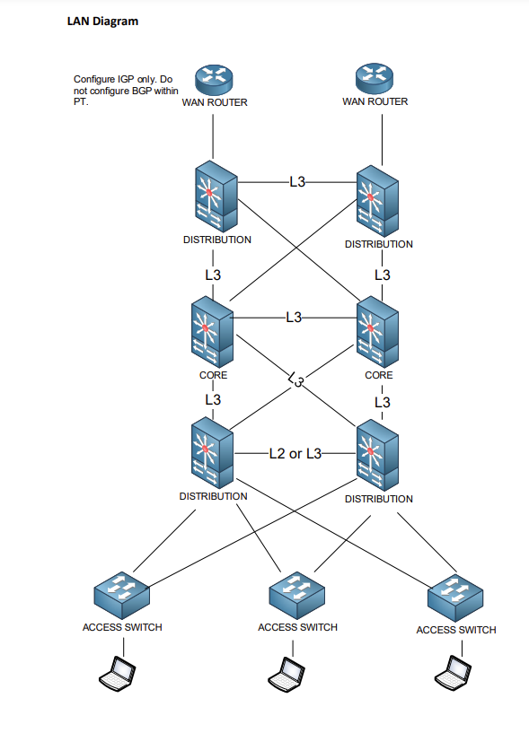
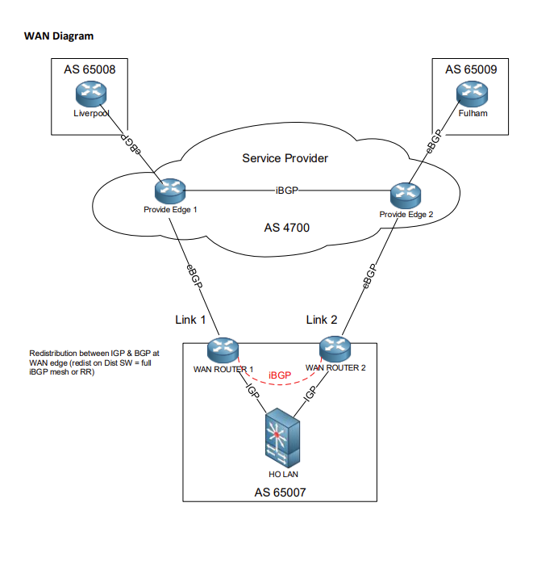

# Assignment 2

## Anthony Legg #03007276

Using Packet Tracer and GNS3 Due: Due: by Monday May 23 

Where to hand in: submit to Michael Holtz via Teams 

Late Penalty: 10% per day late 

# Learning Objectives

1. Understand, evaluate and implement designs for facilitating large scale wide area networks. 
2. Plan and deploy mechanisms for secure network information exchange. 
3. Understand, evaluate and implement solutions for network virtualisation. 
4. Design and implement fault tolerant solutions for high availability of local area and wide  area networks. 
5. Adapt the above tasks as required for specific ICT contexts and/or organisational domains.

## Overview 
Tyrell Corp is opening a new head office site. You have been asked to provide a submission for the  network LAN and WAN design as per the following customer specifications. Your predecessor had agreed a base design for both the LAN and WAN, however there are a number  of decisions to be made and full design specification to be supplied including proof of concept  configurations and testing. Refer to the LAN diagram in the appendix. 
### Special Note 
> This assessment has a special emphasis on critical evaluation. This means that where possible you  are to describe why you have chosen the various features / technologies and give consideration for   alternative solutions. Use the customer questions / requirements below in red to guide you. 

## Head Office LAN Network - Customer Specifications

The customer requires a hierarchical design with discrete Access, Distribution and Core layers providing for availability, scalability and security.
You are tasked with designing: 

  - The Core layer
  - WAN edge block
  - User access block

The core design must allow for additional distribution blocks to be added in the future. 

### User Departments

The user access block will provide for 4 main departments. Each department will exist within its own  subnet. You have been allocated the network range **10.7.0.0/16** to cater for all required subnets  including point to point addressing and management.
  - Admin (12 staff)
  - Sales & Marketing (60 staff)
  - HR (20 staff)
  - Finance (20 staff) 

Growth for each department is not expected to exceed 100%.

### Subnetting

The customer has requested that subnet allocations are easy to summarise, understand and support. 
1. You must describe why this is true for your design.
    I have created the subnets using /24 CIDRs. These are commonly used, have a large number of user IP addresses which can be allocated in future as needed. End user subnets start at the 10.7.1.0/24 and end at 10.7.4.0/24. The 10.7.0.0/24 address space has been allocated to point-to-point connections, this makes it easier to keep track of addresses that are exclusively for the network infrastructure. This also keeps a large address space in reserve for future expansion of the network. An additional subnet has been created for loopback addressing, these addresses are to be allocated as needed for routing and testing purposes. Unused address space has approx. ____ IP addresses unused.
2. You must provide documentation that lists each of the IP Subnets (including L3 links) and what they are used for. 

**Consider** how device management addressing will be allocated. Ensure some point-to-point /30  networks are set aside for the WAN design. 

### Access

The company’s existing LAN deployments utilise L2 VLANS and STP from the distribution layer to the  access layer, however the company will consider layer 3 to the access layer.

3. You are to decide if the access to distribution will be layer2 or layer3 and provide an argument that considers both pros and cons of your decision. 

    The access to distribution will be layer 3. 

    **Cons of Layer 3:**

    - Higher cost of access layer hardware

    **Pros of Layer 3:**

    - Faster processing of IP packets

        Layer 3 devices do not use spanning tree, VLANs. This free CPU processing capacity, allowing routing to occuring much faster

    - Routing and switching is handled internally without the need to be transmitted to a router 

- The many potential advantages of using a Layer 3 access design include the following: 

- Improved convergence 
- Simplified multicast configuration 
- Dynamic traffic load balancing 
- Single control plane
- Single set of troubleshooting tools (for example, ping and traceroute)
- Of these, perhaps the most significant is the improvement in network convergence times possible when using a routed access design configured with EIGRP or OSPF as the routing protocol. Comparing the convergence times for an optimal Layer 2 access design (either with a spanning tree loop or without a loop) against that of the Layer 3 access design, you can obtain a four-fold improvement in convergence times, from 800–900msec for the Layer 2 design to less than 200 msec for the Layer 3 access.

    The additional cost of adding this hardware to the network is  investment 

4. You are to decide if VLANs need to be spanned across access switches or if each access  switch will have a dedicated user VLAN. Why have you made this decision? 

Each switch will have a dedicated user VLAN, this ensures traffic is separated. Layer 3 switches can be divided so that physical connections to the layer 3 can still be made. 

**Note** this decision will influence if the link between the distribution switches is L2 or L3. 

### Resilience

The HO LAN is to provide redundant links and paths where possible while minimising convergence  time. The design needs to consider the impact of a switch failure.

5. The customer requests you describe traffic flow and how it is affected by at least three potential failure scenarios. Use diagrams to indicate primary and alternate traffic paths in the event of device and or link failures.
6. You are to explain how you are using ether channel and if not why?
7. Explain how have the core to distribution links been designed to minimise convergence? 
8. Alternatively if you are using a layer 3 access then describe how you have done this including  the routing protocol used and how the routing metrics have been configured and why. How  does this impact the ability to have redundant host default gateways? 

### Routing

You must specify an appropriate interior gateway protocol to be used for internal routing within the HO site. The interior routing protocol will be used between the Distribution layer, Core layer and  edge routers.

**OSPF selected**

10. Explain why you have chosen the IGP?
    - With OSPF, there is no limitation on the hop count.
    - The intelligent use of VLSM is very useful in IP address allocation.
    - OSPF uses IP multicast to send link-state updates. This ensures less processing on routers that are not listening to OSPF packets. Also, updates are only sent in case routing changes occur instead of periodically. This ensures a better use of bandwidth.
    - OSPF has better convergence than RIP. This is because routing changes are propagated instantaneously and not periodically.
    - OSPF allows for better load balancing.
    - OSPF allows for a logical definition of networks where routers can be divided into areas. This limits the explosion of link state updates over the whole network. This also provides a mechanism for aggregating routes and cutting down on the unnecessary propagation of subnet information.
    - OSPF allows for routing authentication by using different methods of password authentication.
    - OSPF allows for the transfer and tagging of external routes injected into an Autonomous System. This keeps track of external routes injected by exterior protocols such as BGP.
11. Explain how you have configured the IGP including methods you have employed to minimise  convergence time, optimise traffic flow and limit the wasting of bandwidth and CPU calculations. 
- layer 3 etherchannel links configured with no negotiation protocol. 
-  
### Security

The customer has asked you to consider security.
12. Are there any security features that should be deployed within the new HO LAN? Explain  your choices. 
    - ssh for remote management
    - removal of ports from default vlan
    - port security - mac address monitoring
    - BPDU guard

## Customer Specifications - WAN Connectivity 

### Design 
The WAN core is a service provider managed MPLS service. The HO LAN will connect to the WAN via two separate connections. The WAN links to the provider are 100Mb Ethernet. Ensure to design the WAN connectivity and routing as per the customer requirements below. 

### ISP IP Addressing 
The ISP has allocated two point-to-point networks of 172.16.17.0/30 & 172.16.17.4/30 for the Head  Office’s WAN links to the service provider. 
172.16.17.12/30 has been allocated for the Liverpool WAN link. 172.16.17.16/30 has been allocated for the Fulham WAN link. 
Use 172.16.17.8/30 for the link between the Provider Edge routers. 

### Liverpool Site

The remote Liverpool site is included for routing testing purposes. The LAN IP address range is 10.8.0.0/16. You will specify this range in any policy, filtering, routing etc  as needed. 

### Fulham Site

The remote Fulham site is included for routing testing purposes. The LAN IP address range is 10.9.0.0/16. You will specify this range in any policy, filtering, routing etc  as needed. 

### BGP AS Numbering

The MPLS Core BGP AS is 4700 The Head Office has been allocated BGP AS 65007 Liverpool has been allocated BGP AS 65008 Fulham has been allocated BGP AS 65009

### Routing - HO LAN to Service Provider
You are required to use BGP to connect the head office site to the ISP. The company has purchased an active/active service offering from the provider. This means that the company can choose which link to use on a per subnet basis. 

You are to configure BGP policy on the HO LAN WAN Routers such that:

- [ ] For inbound traffic from the Service Provider (& other attached sites) to the HO LAN networks, Link 1 (see appendix diagram) will be used as the primary path. 
- [ ] Traffic will route over Link 2 if the primary path fails. 
- [ ] Only a summary route of the Head Office LAN networks is to be advertised to the ISP via the primary and backup paths.
- [ ] Outbound traffic from the HO LAN network to the Liverpool site will use Link 2 as primary and Link 1 as backup.
- [ ] Outbound traffic from the HO LAN network to the Fulham site will use Link 1 as primary and Link 2 as backup.

13. You are to specify and describe how BGP will be configured to accomplish the above including detail of which BGP attributes are used and why and how the HO LAN networks are summarised.

    

14. You are to ensure the Head Office cannot be used as transit between any other Service Provider attached sites. Explain how you have achieved this.

    

15. You are to ensure end to end connectivity between the HO user VLANs and Liverpool and Fulham sites. Provide evidence of this.

### Security 

The customer has asked you to consider security. 
16. Anti spoof (URPF or ACL) not break Asymmetric traffic 

    

17. You are to choose at least two additional security features that should be deployed on the  WAN routers (not related to VTY or console passwords)? Explain your choices. 

    

## Deliverables
Provide the following documents and evidence. Ensure your work adheres to the marking rubric. 

### Deliverable – LAN design (25%)
  - Describe the LAN design, giving a broad overview of how the design works and meets the  customer requirements.
  - Provide detail of how the chosen features work, paying careful attention to answer the  customer questions in red within the customer specifications above. Supply tables and  diagrams as requested.
  - Supporting references. Include in text referencing and a table of references.

### Deliverable – WAN design (25%)

  - Describe the WAN design, giving a broad overview of how the design works and meets the  customer requirements.
  - Provide detail of how the chosen features work, paying careful attention to answer the  customer questions in red within the customer specifications above. Supply tables and  diagrams as requested.
  - Supporting references. Include in text referencing and a table of references.

### Deliverable – LAN Logical topology diagram (5%) 
  You are to provide a LAN logical topology diagram that includes the following: 
  - Access, distribution, core and WAN edge intermediary devices
  - VLANs / Network addressing
  - Port numbering for infrastructure links (not access ports).
  - Routing domains / Autonomous systems / Areas
  - Default gateways, Virtual IPs
  - Show traffic flows (primary / backup paths) 
    If needed the diagram can be split into multiple parts. The diagram must be separate to the supplied packet tracer or VIRL configuration (though packet tracer or VIRL can be used as the basis). 

### Deliverable – WAN Logical topology diagram (5%) 
  You are to provide a WAN logical topology diagram that includes the following:
  - Distribution layer, WAN edge, Service provider, Liverpool, Fulham
  - Interface / port assignment
  - Network addressing
  - Routing domains / Autonomous systems / Areas
  - Any relevant feature information (e.g. BGP attributes)
  - Show traffic flows (primary / backup paths) 
    If needed the diagram can be split into multiple parts. The diagram must be separate to the supplied  packet tracer or VIRL configuration (though packet tracer or VIRL can be used as the basis).

### Deliverable – LAN Working Configuration (15%) 
  You are to provide a working proof of concept lab within packet tracer. 
  - Include all access, distribution and core switches.
  - Include the WAN edge routers, however BGP configuration is not required on these within Packet Tracer.
  - Ensure all specified technologies and features (including specified security features) are  configured correctly and working.
  - Provide testing output as supporting evidence (e.g. output of relevant show commands) for  each feature. Note: Due to the number of devices you are requested to use packet tracer. Due to packet Tracer limitations, some features may not be available or work as intended. If you have specified any such features in your design you are to provide the configuration of the feature separately.  

### Deliverable – WAN Working Configuration (15%) 
You are to provide a working proof of concept lab within GNS3 (portable project) 
- Include all routers for the HO LAN, Provider edge, Liverpool, Fulham
- The HO LAN WAN edge distribution switches are to be included (to source the HO LAN  networks) however as GNS3 is resource intensive (CPU, mem) the following option can be  implemented to help minimise resource use. HO LAN Can be simulated with a single device that uses loopbacks to source the HO LAN networks as  required. Make sure these match any summary addresses you may already have created within the HO LAN design. See appendix.
- Ensure all specified technologies and features (including specified security features) are  configured correctly and working.
- Provide testing output as supporting evidence (e.g. output of relevant show commands) for  each feature.
- While the service provider core is stated as running MPLS, you do not need to provide any  MPLS configuration.

### Deliverable - Time sheeting
To ensure accurate billing you have been asked to record the time you spend on each activity,  including date, length of time and a brief description of the activity. 

###  Deliverable – Grade your work
You are to review the marking rubric against your work and provide a grade on a scale from F to A+  for each item.

## Notes

he hierarchical campus design has used a full mesh equal-cost path routing design leveraging Layer 3  switching in the core and between distribution layers of the network for many years. The current  generation of Cisco switches can “route” or switch voice and data packets using Layer 3 and Layer 4  information with neither an increase in latency nor loss of capacity in comparison with a pure Layer 2  switch. Because in current hardware, Layer 2 switching and Layer 3 routing perform with equal speed,  Cisco recommends a routed network core in all cases. Routed cores have numerous advantages,  including the following:  • High availability – Deterministic convergence times for any link or node failure in an equal-cost path Layer 3  design of less than 200 msec – No potential for Layer 2 Spanning Tree loops • Scalability and flexibility – Dynamic traffic load balancing with optimal path selection – Structured routing permits for use of modular design and ease of growth • Simplified management and troubleshooting – Simplified routing design eases operational support – Removal of the need to troubleshoot L2/L3 interactions in the core The many advantages of Layer 3 routing in the campus derive from the inherent behavior of the routing  protocols combined with the flexibility and performance of Layer 3 hardware switching. The increased  scalability and resilience of the Layer 3 distribution/core design has proven itself in many customer  networks over the years and continues to be the best practice recommendation for campus design.

## Routing to the Edge  Advantages, 

Yes in the Right Environment Advantages:  • Ease of implementation, less to get right • No matching of STP/HSRP/GLBP priority • No L2/L3 Multicast topology inconsistencies • Single Control Plane and well known tool set • traceroute, show ip route, show ip eigrp neighbour, etc.… • Most Catalysts support L3 Switching today • EIGRP converges in <200 msec • OSPF with sub-second tuning converges in <200 msec • RPVST+ convergence times dependent on GLBP / HSRP tuning Considerations:  • Do you have any Layer 2 VLAN adjacency requirements between access switches? • IP addressing—Do you have enough address space and the allocation plan to support a routed access design?